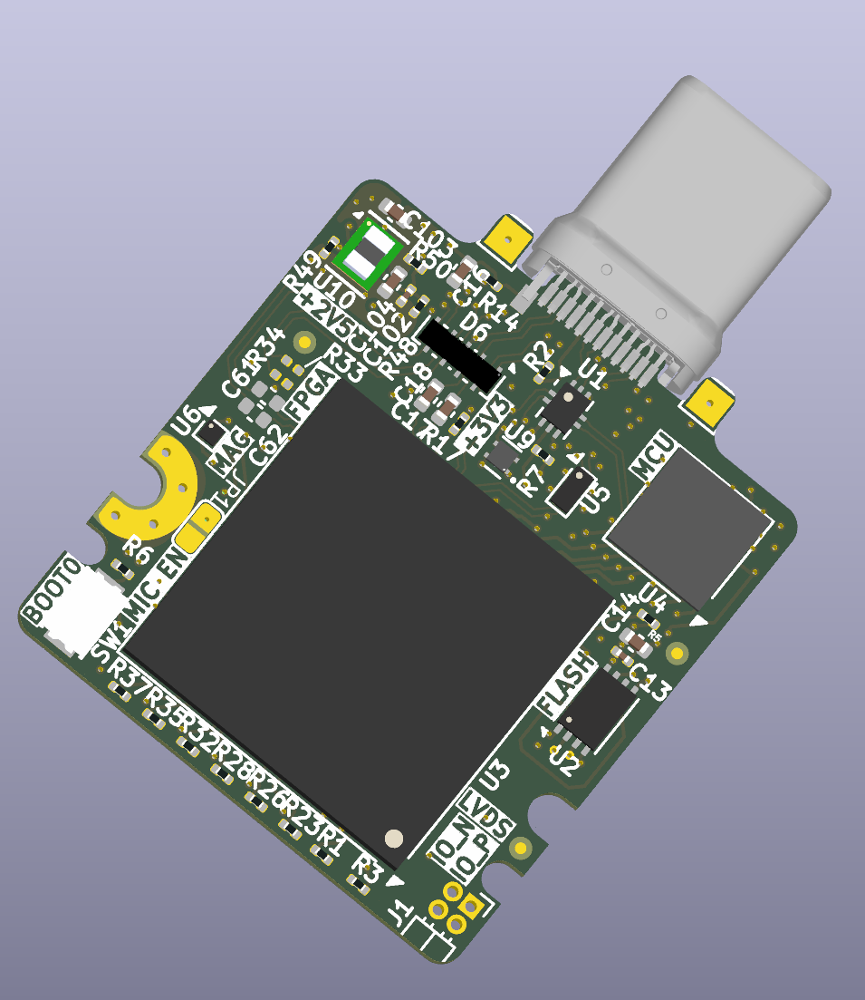

# 📘 Project ExAce


> [!Warning]
>
> Content is not proven and suject to change without notice! Send to fab at your own risk. 


## 🧩 Overview

A tiny yet powerfull fpga acceleration card desiged with the Framework laptop expansion module system in mind.

## 🛠️ Features

- ✅ [CCGM1A1/2/4 compatible](https://colognechip.com/docs/ds1001-gatemate1-datasheet-latest.pdf)
- ✅ 20,480, 40,960 or 81,920 8-input LUT-trees.
- ✅ USB-type C, 5V 1.5A
- ✅ Full acces to SERDES via the usb-c connector (1 for A1/A2 and 2 for A4 device).
- ✅ USB2.0 interface is shared between the fpga and mcu via a USB mux.
- ✅ STM32L422RBI6 coprocessor and programmer.
- ✅ shared uart and i2c between the fpga and microcontroler for easier developement.
- ✅ Free and (almost) Open-source FPGA toolchain!
- ✅ Lots of sensors!: PDM microphone, 6DoF imu, magnetometer, and thermometer.
- ✅ 8 user programmable led ideal for VU meters.
- ✅ 1 lvds IO ideal for connecting multiple board together in a cluster.
- 🔜 TinyFPGA-Bootloader support.
- 🔜 DirtyJTAG support.

---

## 💪 Application

- ✅ Machine learning
- ✅ Simulation
- ✅ Audio/Signal processing
- ✅ Retro Gaming
- ✅ Development platform

## 🗂️ Repository Structure

```bash
📁 /pcb-project-root
├── /3D_Models                    # 3D models of the PCB rendering
├── /Outputs/Fabrication          # Generated Gerber files, BOM and POS for fabrication
├── /PINOUT                       # STM32CubeMx for reference pinout
├── /Testbench/ExAceTestbench     # Testbench to break out serdes signals
├── /.gitignore
└── README.md
```

---

## 🧰 Tools & Dependencies

- **Design Software:** KiCad (v9.0.2 or higher)
- **MCU/FPGA Programmer:** ST-Link,Pico Dirty JTAG
- **Firmware Toolchain:** STM32CubeMX, arm toolchain, [Colonge chip open source toolchain](https://www.colognechip.com/docs/ug1002-toolchain-install-latest.pdf)  

---

## 🖼️ 3D view


  


---

## 🏗️ Getting Started

1. **Clone this repository**
   ```bash
   git clone https://github.com/cdg66/ExAce.git
   ```
2. **Open the project** in KiCad (navigate to `Expansion_Card_Retrofit.kicad_pro`)
3. **Modify / Build / Export Gerbers**

---

## 🚀 Fabrication

To get the board fabricated:

- Use the files in the `/Outputs` directory
- Recommended fabs:
  - [NextPcb](https://www.nextpcb.com/)
  - [JLCPCB](https://jlcpcb.com/) 

Stack-up:


The recommended stackup is the JLC08081H-1080A at JLCPCB but can be done at any other pcb manufacturer.

---


## 🔧 License

This work is licensed under a [Creative Commons Attribution 4.0 International License](https://creativecommons.org/licenses/by/4.0/).

This project references and builds upon the open-source designs from  
[FrameworkComputer/ExpansionCards](https://github.com/FrameworkComputer/ExpansionCards),  
which is also licensed under the [Creative Commons Attribution 4.0 International License (CC-BY-4.0)](https://creativecommons.org/licenses/by/4.0/).

TPSM82822SILR

Footprint: Ultralibrarian

3D model: SnapMagic

Edited by me


S3A2505-100.000-L-X1-R

Symbol, Footprint, 3D model: SnapMagic

Edited by me


1054440011

3D model: Molex


KXT_331_LHS

3D model: SnapMagic


STM32L422RBI6

3D model: SnapMagic


TPS7A2033PDQNR

3D model: SnapMagic


---


